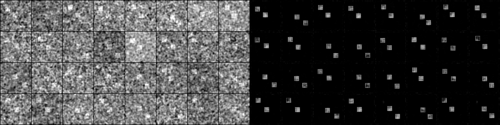
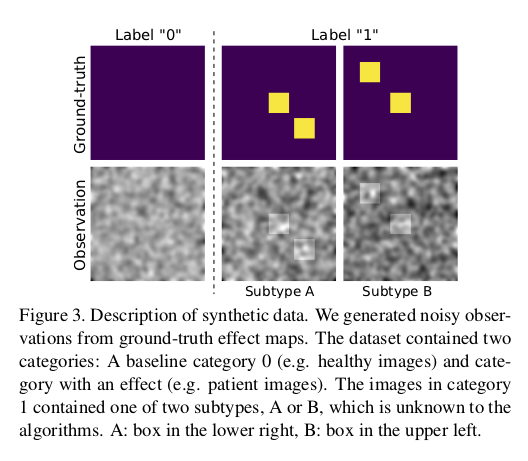

# Visual Feature Attribution Using Wasserstein GANs (with Python and Pytorch)

This code aims to reproduce results obtained in the paper ["Visual Feature Attribution using Wasserstein GANs"](https://arxiv.org/abs/1711.08998)

## Description

This repository contains the code to reproduce results for the paper cited above, where the authors presents a novel feature attribution technique based on Wasserstein Generative Adversarial Networks (WGAN). The code works for both synthetic (2D) and real 3D neuroimaging data, you can check below for a brief description of the two datasets.

### anomaly maps examples

Here is an example of what the generator/mapper network should produce: ctrl-click on the below image to open the gifv in a new tab (one frame every 50 iterations, left: input, right: anomaly map for synthetic data at iteration 50 * (its + 1)).

### Synthetic Dataset

>"Data:
In order to quantitatively evaluate the performance
of the examined visual attribution methods,  we generated
a  synthetic  dataset  of  10000  112x112  images  with  two
classes, which model a healthy control group (label 0) and a
patient group (label 1). The images were split evenly across
the two categories.  We closely followed the synthetic data
generation process described in [31][[SubCMap: Subject and Condition Specific Effect Maps](https://arxiv.org/abs/1701.02610)]
where anomaly effects were studied in smaller cohorts of registered images.
The control group (label 0) contained images with ran-
dom iid Gaussian noise convolved with a Gaussian blurring
filter.  Examples are shown in Fig.  3.  The patient images
(label 1) also contained the noise,  but additionally exhib-
ited one of two anomaly effects which was generated from a
ground-truth effect map: a square in the centre and a square
in the lower right (subtype A), or a square in the centre and a
square in the upper left (subtype B). Importantly, both dis-
ease subtypes shared the same label.   The location of the
off-centre squares was randomly offset in each direction by
a maximum of 5 pixels.  This moving effect was added to
make the problem harder, but had no notable effect on the
outcome."

### ADNI Dataset

Currently we only implemented training on synthetic dataset, we will work on implement training on ADNI dataset asap (but pull requests are welcome as always), we put below ADNI dataset details for sake of completeness.

>"We selected 5778 3D T1-weighted MR images from
1288 subjects with either an MCI (label 0) or AD (label 1) diagnosis from the ADNI cohort. 2839 of the images
were acquired using a 1.5T magnet, the remainder using a
3T magnet. The subjects are scanned at regular intervals as
part of the ADNI study and a number of subjects converted
from MCI to AD over the years. We did not use these cor-
respondences for training, however, we took advantage of it
for evaluation as will be described later.
All images were processed using standard operations
available in the FSL toolbox [52][[Advances in functional and structural MR 
image analysis and implementation as FSL.](https://www.ncbi.nlm.nih.gov/pubmed/15501092)] in order to reorient and
rigidly register the images to MNI space, crop them and
correct for field inhomogeneities. We then skull-stripped
the images using the ROBEX algorithm [24][[Robust brain extraction across datasets and comparison with
publicly available methods](https://www.ncbi.nlm.nih.gov/pubmed/21880566)]. Lastly, we
resampled all images to a resolution of 1.3 mm 3 and nor-
malised them to a range from -1 to 1. The final volumes
had a size of 128x160x112 voxels."

>"Data used in preparation of this article were obtained from
the Alzheimers anomaly Neuroimaging Initiative (ADNI) database
([adni.loni.usc.edu](http://adni.loni.usc.edu)).
As such, the investigators within the ADNI
contributed to the design and implementation of ADNI and/or provided data but 
did not participate in analysis or writing of this
report. A complete listing of ADNI investigators can be found at:
[http://adni.loni.usc.edu/wp-content/uploads/how_to_apply/ADNI_Acknowledgement_List.pdf](http://adni.loni.usc.edu/wp-content/uploads/how_to_apply/ADNI_Acknowledgement_List.pdf)"

## Usage

### Synthetic data generation
In order to generate the synthetic dataset, cd into this repo's `src` root folder and execute:

    $ python generate_synth_data.py

This script takes the following command line options:

- `out_dir`: directory for the generated files, default to `../dataset/`

- `image_size`: width and heigth for the generated images

- `square_size`: width and heigth for the inner squares in the masks (anomaly size)

- `offset`: maximum absolute offset in pixels for the off-centre inner squares in the masks (off centre anomalies max offset)

- `num_samples`: number of samples to generate for each label (`total samples = num_samples * 2`)

Running the command without arguments will generate a total of 20k 1x128x128 png images (10k images in `data` and 10k masks in `masks`, masks are not needed for this prroject), with inner squares of 20x20 pixels and a maximum random offset for the offcentre squares of 5 pixels. 

### Training

To train the WGAN on this task, cd into this repo's `src` root folder and execute:

    $ python train.py

This script takes the following command line options:

- `dataset_root`: the root directory where tha dataset is stored, default to `'../dataset'`

- `experiment`: directory in where samples and models will be saved, default to `'../samples'`

- `batch_size`: input batch size, default to `32`

- `image_size`: the height / width of the input image to network, default to `128`

- `channels_number`: input image channels, default to `1`

- `num_filters_g`: number of filters for the first layer of the generator, default to `16`

- `num_filters_d`: number of filters for the first layer of the discriminator, default to `16`

- `nepochs`: number of epochs to train for, default to `1000`

- `d_iters`: number of discriminator iterations per each generator iter, default to `5`

- `learning_rate_g`: learning rate for generator, default to `1e-5`

- `learning_rate_d`: learning rate for discriminator, default to `1e-5`

- `beta1`: beta1 for adam. default to `0.0`

- `cuda`: enables cuda (store True)

- `manual_seed`: input for the manual seeds initializations, default to `7`

Running the command without arguments will train the models with the default hyperparamters values (producing results shown above).

## Models

Instead of using the models described in the paper we used an [UNet](https://github.com/milesial/Pytorch-UNet) as generator and a [DCGAN_D](https://github.com/lim0606/pytorch-geometric-gan/blob/master/models/dcgan.py) as discriminator.

## Useful repositories and code

 - [ganhacks](https://github.com/soumith/ganhacks): Starter from "How to Train a GAN?" at NIPS2016

 - [WassersteinGAN](https://github.com/martinarjovsky/WassersteinGAN): Code accompanying the paper "Wasserstein GAN"

 - [wgan-gp](https://github.com/caogang/wgan-gp): Pytorch implementation of Paper "Improved Training of Wasserstein GANs".

 - [c3d-pytorch](https://github.com/DavideA/c3d-pytorch/blob/master/C3D_model.py): Model used as discriminator in the reference paper

 - [Pytorch-UNet](https://github.com/milesial/Pytorch-UNet): Model used as genertator in this repository

 - [dcgan](https://github.com/lim0606/pytorch-geometric-gan/blob/master/models/dcgan.py): Model used as discriminator in this repository

## .bib citation
cite the paper as follow (copied-pasted it from arxiv for you):

    @article{DBLP:journals/corr/abs-1711-08998,
      author    = {Christian F. Baumgartner and
                   Lisa M. Koch and
                   Kerem Can Tezcan and
                   Jia Xi Ang and
                   Ender Konukoglu},
      title     = {Visual Feature Attribution using Wasserstein GANs},
      journal   = {CoRR},
      volume    = {abs/1711.08998},
      year      = {2017},
      url       = {http://arxiv.org/abs/1711.08998},
      archivePrefix = {arXiv},
      eprint    = {1711.08998},
      timestamp = {Sun, 03 Dec 2017 12:38:15 +0100},
      biburl    = {http://dblp.org/rec/bib/journals/corr/abs-1711-08998},
      bibsource = {dblp computer science bibliography, http://dblp.org}
    }

## License

This project is licensed under the MIT License

Copyright (c) 2018 Daniele E. Ciriello, Orobix Srl (www.orobix.com).
